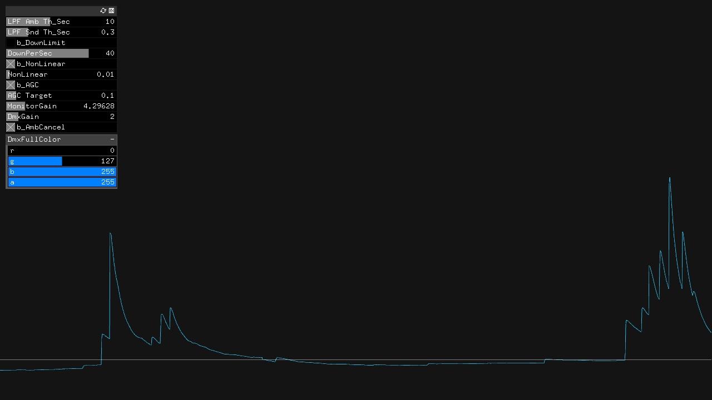

#study__SoundToDmx

##環境
*	OS X El Capitan(10.11.6)
*	Xcode : 7.2
*	oF : 0.9.0

##add on
ofxArtnet  
ofxGui  
ofxNetwork  
ofxOsc  
ofxXmlSettings  

##Contents
Mic input をFilterしてGraph化。  
さらに、この音圧に連動してofxArtnet経由で外部照明を操作。  
for smiles.  

  

##Device
*	Mic  
	EMM-6
*	Audio I/F  
	EDITOL by Roland.  
	

##note

